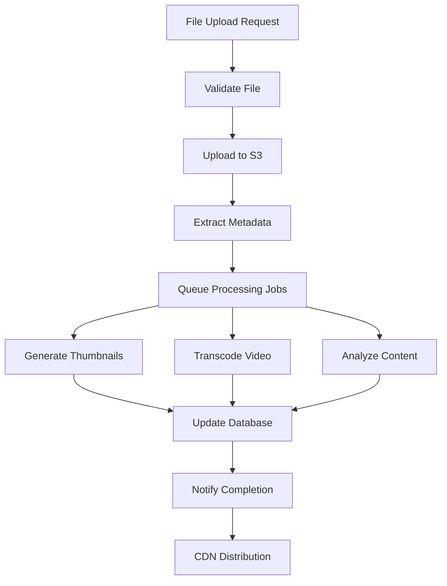

# 🎬 Media Processing Service

## Service Overview

**Domain**: Media asset management, processing, and optimization  
**Core Purpose**: Handle all media-related operations including upload, processing, transcoding, and analysis  
**Service Type**: Core Infrastructure Service  
**Dependencies**: Content Management Service, User Management Service, Notification Service

---

## 🎯 Functional Responsibilities

### **Primary Functions**
```
├── Media file upload and validation
├── Video transcoding and format conversion
├── Audio processing and optimization
├── Image processing and thumbnail generation
├── Content transcription (Arabic & English)
├── Media metadata extraction
├── Content moderation and safety checks
└── CDN distribution and optimization
```

### **Secondary Functions**
```
├── Media file compression and optimization
├── Subtitle and caption generation
├── Audio enhancement and normalization
├── Image format conversion and resizing
├── Video preview and trailer generation
├── Media analytics and reporting
├── Storage lifecycle management
└── Batch processing for legacy content
```

---

## 🔧 Technical Architecture

### **Tech Stack Specification**
```
Primary Technology:
├── Programming Language: Python 3.11+ (FastAPI)
├── Media Processing: FFmpeg, OpenCV, PIL/Pillow
├── Async Processing: Celery + Redis (background tasks)
├── File Storage: Amazon S3 + CloudFront CDN
└── Database: PostgreSQL (metadata) + Redis (processing status)

AWS Media Services:
├── Video Processing: AWS Elemental MediaConvert
├── Transcription: Amazon Transcribe (Arabic/English)
├── Content Analysis: Amazon Rekognition
├── Content Moderation: Amazon Rekognition (unsafe content detection)
└── File Transfer: Amazon S3 Transfer Acceleration

Supporting Infrastructure:
├── Message Queue: Celery + Redis/SQS
├── Monitoring: CloudWatch + Custom metrics
├── Caching: Redis (processing results)
└── Event Publishing: NATS (processing status updates)
```

### **Service Architecture Diagram**
```
┌─────────────────────────────────────────────────────────────┐
│                    Media Processing Service                 │
├─────────────────┬───────────────────┬───────────────────────┤
│   Upload API    │  Processing Engine │    Analysis Engine    │
│   (FastAPI)     │     (Celery)      │   (AWS AI Services)   │
├─────────────────┼───────────────────┼───────────────────────┤
│ • File Upload   │ • Video Transcode │ • Content Recognition │
│ • Validation    │ • Audio Process   │ • Transcription       │
│ • Progress      │ • Image Optimize  │ • Moderation          │
│ • Status API    │ • Thumbnail Gen   │ • Metadata Extract    │
└─────────────────┴───────────────────┴───────────────────────┘
         │                 │                       │
         ▼                 ▼                       ▼
┌─────────────────┬───────────────────┬───────────────────────┐
│   File Storage  │   Processing Queue│     Results Cache     │
│   (S3 + CDN)    │   (Redis/SQS)     │      (Redis)          │
└─────────────────┴───────────────────┴───────────────────────┘
```

---

## 🚀 API Specifications

### **Core APIs**

#### **File Upload API**
```http
POST /api/v1/media/upload
Content-Type: multipart/form-data

Request Body:
├── file: Binary file data
├── filename: String
├── content_type: String (video/audio/image)
├── metadata: JSON (optional)
└── processing_options: JSON (optional)

Response (202 Accepted):
{
  "upload_id": "uuid",
  "status": "uploading",
  "progress_url": "/api/v1/media/upload/{upload_id}/progress",
  "estimated_completion": "2024-01-15T14:30:00Z"
}

Validation Rules:
├── Max file size: 5GB
├── Supported formats: MP4, AVI, MOV, MP3, WAV, JPG, PNG, WebP
├── Virus scanning: ClamAV integration
└── Content policy: Automated moderation
```

#### **Processing Status API**
```http
GET /api/v1/media/job/{jobId}/status

Response (200 OK):
{
  "job_id": "uuid",
  "status": "processing", // pending, processing, completed, failed
  "progress": 75,
  "current_step": "transcoding",
  "steps": [
    {
      "name": "upload",
      "status": "completed",
      "started_at": "2024-01-15T14:00:00Z",
      "completed_at": "2024-01-15T14:05:00Z"
    },
    {
      "name": "transcoding",
      "status": "processing",
      "started_at": "2024-01-15T14:05:00Z",
      "progress": 75
    }
  ],
  "results": {
    "original_url": "https://cdn.thmnayah.com/original/file.mp4",
    "variants": [
      {
        "quality": "720p",
        "format": "mp4",
        "url": "https://cdn.thmnayah.com/720p/file.mp4",
        "file_size": 1048576
      }
    ],
    "thumbnails": [
      {
        "timestamp": 30,
        "url": "https://cdn.thmnayah.com/thumbs/file_30s.jpg"
      }
    ]
  }
}
```

#### **Transcoding API**
```http
POST /api/v1/media/transcode

Request Body:
{
  "source_url": "https://s3.amazonaws.com/bucket/original.mp4",
  "output_formats": [
    {
      "quality": "1080p",
      "format": "mp4",
      "bitrate": "5000k"
    },
    {
      "quality": "720p", 
      "format": "mp4",
      "bitrate": "2500k"
    },
    {
      "quality": "480p",
      "format": "mp4", 
      "bitrate": "1000k"
    }
  ],
  "generate_thumbnails": true,
  "thumbnail_count": 10
}

Response (202 Accepted):
{
  "job_id": "uuid",
  "estimated_completion": "2024-01-15T15:00:00Z",
  "status_url": "/api/v1/media/job/{job_id}/status"
}
```

#### **Content Analysis API**
```http
POST /api/v1/media/analyze

Request Body:
{
  "media_url": "https://cdn.thmnayah.com/video.mp4",
  "analysis_types": ["transcription", "moderation", "objects", "faces"],
  "languages": ["ar", "en"]
}

Response (202 Accepted):
{
  "analysis_id": "uuid",
  "status": "pending",
  "results_url": "/api/v1/media/analysis/{analysis_id}/results"
}

Analysis Results:
{
  "analysis_id": "uuid",
  "status": "completed",
  "results": {
    "transcription": {
      "language": "ar",
      "confidence": 0.95,
      "text": "النص المنسوخ من الفيديو...",
      "timestamps": [
        {"start": 0, "end": 5.2, "text": "مرحبا بكم"}
      ]
    },
    "moderation": {
      "safe": true,
      "confidence": 0.98,
      "flags": []
    },
    "objects": [
      {"label": "person", "confidence": 0.9, "timestamp": 15.5}
    ]
  }
}
```

---

## 📊 Data Models

### **Database Schema**

#### **MediaAsset**
```sql
CREATE TABLE media_assets (
    id UUID PRIMARY KEY DEFAULT gen_random_uuid(),
    original_filename VARCHAR(255) NOT NULL,
    content_type VARCHAR(50) NOT NULL, -- video, audio, image
    mime_type VARCHAR(100) NOT NULL,
    file_size BIGINT NOT NULL,
    s3_bucket VARCHAR(100) NOT NULL,
    s3_key VARCHAR(500) NOT NULL,
    cdn_url VARCHAR(1000),
    upload_status VARCHAR(20) DEFAULT 'pending', -- pending, uploading, processing, completed, failed
    upload_progress INTEGER DEFAULT 0,
    metadata JSONB,
    checksum VARCHAR(64), -- SHA256 hash
    uploaded_by UUID REFERENCES users(id),
    created_at TIMESTAMP WITH TIME ZONE DEFAULT CURRENT_TIMESTAMP,
    updated_at TIMESTAMP WITH TIME ZONE DEFAULT CURRENT_TIMESTAMP
);

CREATE INDEX idx_media_assets_status ON media_assets(upload_status);
CREATE INDEX idx_media_assets_type ON media_assets(content_type);
CREATE INDEX idx_media_assets_uploaded_by ON media_assets(uploaded_by);
```

#### **MediaVariant**
```sql
CREATE TABLE media_variants (
    id UUID PRIMARY KEY DEFAULT gen_random_uuid(),
    media_asset_id UUID REFERENCES media_assets(id) ON DELETE CASCADE,
    variant_type VARCHAR(50) NOT NULL, -- thumbnail, preview, low_res, high_res, audio_only
    format VARCHAR(10) NOT NULL, -- mp4, webm, jpg, png, mp3, etc.
    quality VARCHAR(20), -- 1080p, 720p, 480p, etc.
    resolution VARCHAR(20), -- 1920x1080, etc.
    bitrate VARCHAR(20), -- 5000k, 2500k, etc.
    duration INTEGER, -- seconds, for video/audio
    s3_bucket VARCHAR(100) NOT NULL,
    s3_key VARCHAR(500) NOT NULL,
    cdn_url VARCHAR(1000),
    file_size BIGINT,
    processing_status VARCHAR(20) DEFAULT 'pending',
    processing_progress INTEGER DEFAULT 0,
    created_at TIMESTAMP WITH TIME ZONE DEFAULT CURRENT_TIMESTAMP
);

CREATE INDEX idx_media_variants_asset ON media_variants(media_asset_id);
CREATE INDEX idx_media_variants_type ON media_variants(variant_type);
```

#### **ProcessingJob**
```sql
CREATE TABLE processing_jobs (
    id UUID PRIMARY KEY DEFAULT gen_random_uuid(),
    media_asset_id UUID REFERENCES media_assets(id) ON DELETE CASCADE,
    job_type VARCHAR(50) NOT NULL, -- transcode, analyze, thumbnail, etc.
    status VARCHAR(20) DEFAULT 'pending', -- pending, processing, completed, failed, cancelled
    progress INTEGER DEFAULT 0,
    started_at TIMESTAMP WITH TIME ZONE,
    completed_at TIMESTAMP WITH TIME ZONE,
    error_message TEXT,
    input_parameters JSONB,
    output_results JSONB,
    aws_job_id VARCHAR(255), -- For AWS MediaConvert jobs
    created_at TIMESTAMP WITH TIME ZONE DEFAULT CURRENT_TIMESTAMP
);

CREATE INDEX idx_processing_jobs_status ON processing_jobs(status);
CREATE INDEX idx_processing_jobs_type ON processing_jobs(job_type);
```

#### **ContentAnalysis**
```sql
CREATE TABLE content_analysis (
    id UUID PRIMARY KEY DEFAULT gen_random_uuid(),
    media_asset_id UUID REFERENCES media_assets(id) ON DELETE CASCADE,
    analysis_type VARCHAR(50) NOT NULL, -- transcription, moderation, objects, faces
    language VARCHAR(10), -- ar, en, etc.
    status VARCHAR(20) DEFAULT 'pending',
    confidence_score DECIMAL(3,2),
    results JSONB,
    aws_job_id VARCHAR(255),
    created_at TIMESTAMP WITH TIME ZONE DEFAULT CURRENT_TIMESTAMP,
    completed_at TIMESTAMP WITH TIME ZONE
);

CREATE INDEX idx_content_analysis_asset ON content_analysis(media_asset_id);
CREATE INDEX idx_content_analysis_type ON content_analysis(analysis_type);
```

---

## ⚙️ Processing Workflows

### **Video Upload & Processing Workflow**


### **Processing Pipeline Steps**

#### **1. File Upload & Validation**
```python
# Upload validation workflow
async def validate_upload(file: UploadFile) -> ValidationResult:
    """Validate uploaded file before processing"""
    
    # File size validation
    if file.size > MAX_FILE_SIZE:
        raise ValidationError("File size exceeds limit")
    
    # File type validation
    mime_type = magic.from_buffer(await file.read(1024), mime=True)
    if mime_type not in ALLOWED_MIME_TYPES:
        raise ValidationError("Unsupported file type")
    
    # Virus scanning
    scan_result = await scan_file_for_viruses(file)
    if not scan_result.is_safe:
        raise SecurityError("File contains malicious content")
    
    # Content policy check
    if mime_type.startswith('video/'):
        moderation_result = await quick_moderation_check(file)
        if not moderation_result.is_appropriate:
            raise ContentError("Content violates policy")
    
    return ValidationResult(valid=True, mime_type=mime_type)
```

#### **2. Transcoding Workflow**
```python
# Video transcoding pipeline
async def transcode_video(media_asset: MediaAsset) -> List[MediaVariant]:
    """Transcode video to multiple formats and qualities"""
    
    job_id = str(uuid.uuid4())
    
    # Create MediaConvert job
    mediaconvert_job = {
        'JobTemplate': 'thmnayah-video-transcode',
        'Settings': {
            'Inputs': [{
                'FileInput': media_asset.s3_url,
                'VideoSelector': {},
                'AudioSelectors': {'Audio Selector 1': {'DefaultSelection': 'DEFAULT'}}
            }],
            'OutputGroups': [
                # 1080p MP4
                {
                    'OutputGroupSettings': {
                        'FileGroupSettings': {
                            'Destination': f's3://{S3_BUCKET}/1080p/{job_id}/'
                        }
                    },
                    'Outputs': [{
                        'VideoDescription': {
                            'CodecSettings': {'Codec': 'H_264'},
                            'Width': 1920,
                            'Height': 1080,
                            'VideoPreprocessors': {
                                'ImageInserter': create_watermark_settings()
                            }
                        },
                        'AudioDescriptions': [{
                            'CodecSettings': {'Codec': 'AAC'}
                        }]
                    }]
                },
                # 720p MP4
                {
                    'OutputGroupSettings': {
                        'FileGroupSettings': {
                            'Destination': f's3://{S3_BUCKET}/720p/{job_id}/'
                        }
                    },
                    'Outputs': [{
                        'VideoDescription': {
                            'CodecSettings': {'Codec': 'H_264'},
                            'Width': 1280,
                            'Height': 720
                        }
                    }]
                }
            ]
        }
    }
    
    # Submit job to AWS MediaConvert
    response = mediaconvert_client.create_job(**mediaconvert_job)
    aws_job_id = response['Job']['Id']
    
    # Create processing job record
    processing_job = ProcessingJob(
        media_asset_id=media_asset.id,
        job_type='transcode',
        aws_job_id=aws_job_id,
        input_parameters=mediaconvert_job,
        status='processing'
    )
    await db.save(processing_job)
    
    return processing_job
```

#### **3. Content Analysis Pipeline**
```python
# Content analysis workflow
async def analyze_content(media_asset: MediaAsset, analysis_types: List[str]) -> Dict:
    """Analyze media content using AWS AI services"""
    
    results = {}
    
    if 'transcription' in analysis_types:
        # Audio/Video transcription
        transcribe_job = await start_transcription_job(
            job_name=f"transcribe-{media_asset.id}",
            media_uri=media_asset.s3_url,
            language_code='ar'  # or auto-detect
        )
        results['transcription'] = transcribe_job
    
    if 'moderation' in analysis_types:
        # Content moderation
        moderation_job = await start_content_moderation(
            video_s3_object={
                'Bucket': media_asset.s3_bucket,
                'Name': media_asset.s3_key
            }
        )
        results['moderation'] = moderation_job
    
    if 'objects' in analysis_types:
        # Object and scene detection
        detection_job = await start_label_detection(
            video_s3_object={
                'Bucket': media_asset.s3_bucket,
                'Name': media_asset.s3_key
            }
        )
        results['objects'] = detection_job
    
    if 'faces' in analysis_types:
        # Face detection and recognition
        face_job = await start_face_detection(
            video_s3_object={
                'Bucket': media_asset.s3_bucket,
                'Name': media_asset.s3_key
            }
        )
        results['faces'] = face_job
    
    # Store analysis jobs
    for analysis_type, job_info in results.items():
        analysis = ContentAnalysis(
            media_asset_id=media_asset.id,
            analysis_type=analysis_type,
            aws_job_id=job_info['JobId'],
            status='processing'
        )
        await db.save(analysis)
    
    return results
```

---

## 📈 Performance Requirements

### **Processing Performance Targets**
```
File Upload:
├── Upload speed: >50 MB/s for large files
├── Resume capability: Support interrupted uploads
├── Progress tracking: Real-time progress updates
├── Concurrent uploads: Support 100+ simultaneous uploads
└── Validation time: <5 seconds for files up to 1GB

Video Transcoding:
├── Processing speed: <2x real-time (1-hour video in <2 hours)
├── Quality retention: >95% visual quality preservation
├── Multiple formats: Generate 3+ quality levels simultaneously
├── Batch processing: Handle 50+ videos concurrently
└── Error rate: <2% processing failures

Thumbnail Generation:
├── Generation time: <30 seconds for any video length
├── Thumbnail count: 10+ frames per video
├── Image optimization: WebP format with fallback
├── Batch creation: 20+ thumbnails simultaneously
└── Preview generation: <60 seconds for video previews

Content Analysis:
├── Transcription speed: <0.5x real-time (1-hour video in <30 minutes)
├── Transcription accuracy: >90% for clear audio
├── Moderation speed: <5 minutes for 1-hour video
├── Object detection: <10 minutes for 1-hour video
└── Face recognition: <15 minutes for 1-hour video

System Performance:
├── API response time: <200ms for status queries
├── Throughput: 1000+ API requests per second
├── Availability: 99.9% uptime SLA
├── Data durability: 99.999999999% (11 9's)
└── CDN propagation: <60 seconds globally
```

### **Scalability Considerations**
```
Horizontal Scaling:
├── Stateless service design
├── Load balancer distribution
├── Auto-scaling based on queue depth
├── Independent worker scaling
└── Database read replicas

Resource Optimization:
├── GPU utilization for ML tasks
├── Adaptive quality based on content
├── Intelligent caching strategies
├── Preemptible instances for batch jobs
└── Storage lifecycle policies

Monitoring & Alerting:
├── Processing queue depth monitoring
├── Error rate tracking and alerting
├── Resource utilization dashboards
├── Cost optimization insights
└── Performance trend analysis
```

---

## 🔒 Security & Compliance

### **Data Security**
```
File Security:
├── Virus scanning on upload
├── Content moderation for policy compliance
├── Encrypted storage at rest (S3 SSE)
├── Encrypted transfer (TLS 1.3)
└── Access logging and auditing

Access Control:
├── JWT-based API authentication
├── Role-based processing permissions
├── Signed URLs for secure file access
├── Time-limited access tokens
└── IP-based access restrictions

Content Protection:
├── Digital watermarking for videos
├── DRM integration capability
├── Geographic access restrictions
├── Download prevention measures
└── Forensic tracking capabilities
```

### **Compliance Requirements**
```
Data Privacy:
├── GDPR compliance for EU users
├── Data retention policies
├── Right to deletion implementation
├── Privacy-preserving analytics
└── User consent management

Content Standards:
├── Automated content moderation
├── Manual review workflows
├── Age-appropriate content classification
├── Cultural sensitivity checks
└── Copyright infringement detection
```

---

## 🔧 Configuration & Deployment

### **Environment Configuration**
```yaml
# config/production.yaml
media_processing:
  max_file_size: 5368709120  # 5GB
  supported_formats:
    video: [mp4, avi, mov, mkv, webm]
    audio: [mp3, wav, aac, flac, ogg]
    image: [jpg, jpeg, png, webp, gif]
  
  processing:
    video_qualities: [1080p, 720p, 480p, 360p]
    thumbnail_count: 10
    preview_duration: 30  # seconds
    concurrent_jobs: 50
  
  aws:
    s3_bucket: thmnayah-media-production
    mediaconvert_role: arn:aws:iam::account:role/MediaConvertRole
    transcribe_language_codes: [ar-SA, en-US]
    
  redis:
    host: redis-cluster.production.local
    port: 6379
    db: 0
    
  database:
    host: postgres.production.local
    port: 5432
    name: thmnayah_media
    pool_size: 20
```

### **Docker Configuration**
```dockerfile
# Dockerfile
FROM python:3.11-slim

# Install system dependencies
RUN apt-get update && apt-get install -y \
    ffmpeg \
    imagemagick \
    libmagic-dev \
    clamav \
    && rm -rf /var/lib/apt/lists/*

# Install Python dependencies
COPY requirements.txt .
RUN pip install --no-cache-dir -r requirements.txt

# Copy application code
COPY ./app /app
WORKDIR /app

# Configure ClamAV
RUN freshclam

EXPOSE 8000

CMD ["uvicorn", "main:app", "--host", "0.0.0.0", "--port", "8000"]
```

This comprehensive Media Processing Service specification provides all the technical details needed for implementation, including APIs, data models, workflows, and deployment configurations.