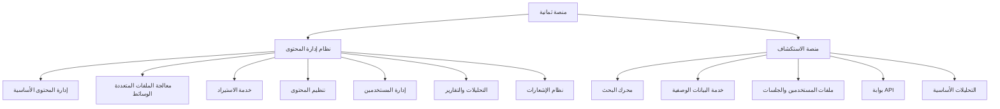

# مشروع ثمانية: منهجية التطوير الشاملة
## من المتطلبات الأساسية إلى الحد الأدنى من المنتج القابل للتطبيق (MVP)

---

## 📋 المحتوى

1. [المتطلبات التجارية الأساسية](#المتطلبات-التجارية-الأساسية)
2. [إثراء المتطلبات وتطوير قصص المستخدم](#إثراء-المتطلبات-وتطوير-قصص-المستخدم)
3. [خريطة الميزات والوظائف](#خريطة-الميزات-والوظائف)
4. [تصميم البنية التحتية](#تصميم-البنية-التحتية)
5. [تصميم الخدمات](#تصميم-الخدمات)
6. [تقسيم العمل والتطوير](#تقسيم-العمل-والتطوير)
7. [تحديد نطاق الحد الأدنى من المنتج](#تحديد-نطاق-الحد-الأدنى-من-المنتج)

---

## 🎯 المتطلبات التجارية الأساسية

### المتطلبات المستخلصة من المهمة الأولية:

**1. نظام إدارة المحتوى (CMS)**
- إنشاء وتحرير المحتوى (فيديوهات، مقالات)
- إدارة البيانات الوصفية (العنوان، الوصف، التصنيف، اللغة، المدة)
- استيراد البيانات من مصادر خارجية (YouTube، RSS feeds)
- تنظيم المحتوى (السلاسل، الحلقات، المحتوى المميز)
- إدارة المستخدمين والصلاحيات

**2. منصة الاستكشاف (Discovery Platform)**
- تصفح جميع البرامج والبحث بالعنوان/الوصف
- التصفية حسب التصنيف، اللغة، التاريخ، المدة، الشعبية
- عرض تفاصيل البرنامج والبرامج ذات الصلة
- واجهة ثنائية اللغة (العربية/الإنجليزية)
- تصميم متجاوب وتحميل سريع

**3. المتطلبات التقنية**
- دعم اللغتين العربية والإنجليزية
- أداء عالي وقابلية التوسع
- أمان وحماية البيانات
- تجربة مستخدم ممتازة

---

## 🚀 إثراء المتطلبات وتطوير قصص المستخدم

### منهجية تطوير قصص المستخدم

**المرحلة 1: تحليل أصحاب المصلحة**
```
المستخدمون الداخليون:
├── مدراء المحتوى
├── محرري المحتوى  
├── مسؤولي النظام
└── القيادة التنفيذية

المستخدمون الخارجيون:
├── الباحثون عن المحتوى
├── المعلمون والدعاة
├── الطلاب وطلاب العلم
└── المجتمع العام
```

**المرحلة 2: تطوير قصص المستخدم المفصلة**

### قصص المستخدم للنظام الإداري (CMS):

**كمدير محتوى:**
- أريد إنشاء برامج فيديو جديدة مع البيانات الوصفية الكاملة
- أريد تنظيم المحتوى في سلاسل وحلقات لسهولة التصفح
- أريد استيراد المحتوى من قناة YouTube تلقائياً
- أريد جدولة نشر المحتوى في أوقات محددة
- أريد تتبع أداء المحتوى ومعدلات المشاهدة

**كمحرر محتوى:**
- أريد إنشاء وتحرير المحتوى بسهولة
- أريد رفع الملفات الصوتية والمرئية
- أريد إضافة النصوص والترجمات
- أريد معاينة المحتوى قبل النشر
- أريد التعاون مع فريق العمل في تحرير المحتوى

### قصص المستخدم لمنصة الاستكشاف:

**كباحث عن المحتوى:**
- أريد البحث عن المحتوى باللغة العربية والإنجليزية
- أريد تصفية النتائج حسب الموضوع والمتحدث
- أريد اكتشاف محتوى جديد مناسب لاهتماماتي
- أريد الوصول السريع للمحتوى على جميع الأجهزة
- أريد مشاركة المحتوى مع الآخرين بسهولة

**كمعلم:**
- أريد العثور على محتوى تعليمي مناسب للطلاب
- أريد تصفح المحتوى حسب الموضوع والمستوى
- أريد إنشاء قوائم تشغيل للدروس
- أريد تتبع المحتوى الذي استخدمته سابقاً

---

## 🗺️ خريطة الميزات والوظائف

### خريطة الميزات الشاملة



### تفصيل الميزات حسب الأولوية:

**الأولوية العالية (Phase 1)**
```yaml
نظام إدارة المحتوى:
  ✅ إنشاء وتحرير المحتوى
  ✅ إدارة البيانات الوصفية
  ✅ إدارة المستخدمين الأساسية
  ✅ رفع الملفات الأساسي
  ✅ استيراد من YouTube

منصة الاستكشاف:
  ✅ البحث النصي الكامل
  ✅ تصفية وتصنيف المحتوى
  ✅ واجهة مستخدم متجاوبة
  ✅ دعم ثنائي اللغة
  ✅ إدارة الجلسات الأساسية
```

**الأولوية المتوسطة (Phase 2)**
```yaml
الميزات المحسنة:
  ⏳ البحث الدلالي بالذكاء الاصطناعي
  ⏳ التوصيات الشخصية
  ⏳ التحليلات المتقدمة
  ⏳ معالجة متقدمة للوسائط
  ⏳ الاستيراد التلقائي المجدول
```

**الأولوية المنخفضة (Phase 3)**
```yaml
الميزات المتقدمة:
  🔮 البحث الصوتي
  🔮 البحث متعدد الوسائط
  🔮 الميزات الاجتماعية
  🔮 التحسين العالمي
  🔮 تطبيقات الجوال المحلية
```

---

## 🏗️ تصميم البنية التحتية

### تطور البنية التحتية

**المرحلة 1: التحليل المبدئي**
- مراجعة المتطلبات التقنية
- تحديد التقنيات المناسبة
- تقييم خيارات النشر والاستضافة

**المرحلة 2: تصميم البنية الأساسية**
```yaml
البنية التحتية الأساسية:
  الحاسوب السحابي: AWS
  الحاويات: Docker + ECS Fargate
  قواعد البيانات: PostgreSQL + Redis + OpenSearch
  التخزين: Amazon S3 + CloudFront
  التشبيك: Application Load Balancer
  الأمان: WAF + SSL/TLS + VPC
```

**المرحلة 3: التحسين للذكاء الاصطناعي**
```yaml
خدمات الذكاء الاصطناعي:
  التعلم الآلي: Amazon SageMaker
  معالجة اللغة: Amazon Bedrock
  قاعدة البيانات المتجهة: Pinecone / OpenSearch Vector
  التحليلات الفورية: Amazon Kinesis
  معالجة البيانات: Apache Spark
```

### مخطط البنية التحتية النهائية:

```
┌─────────────────────────────────────────────────────────────┐
│                    مستوى العرض (Presentation)               │
├─────────────────────────────────────────────────────────────┤
│  CloudFront CDN  │  واجهة المستخدم React  │  تطبيق الجوال    │
└─────────────────────────────────────────────────────────────┘
                                │
┌─────────────────────────────────────────────────────────────┐
│                     مستوى API Gateway                       │
├─────────────────────────────────────────────────────────────┤
│     Kong Gateway │ Rate Limiting │ Authentication          │
└─────────────────────────────────────────────────────────────┘
                                │
┌─────────────────────────────────────────────────────────────┐
│                   مستوى الخدمات المصغرة                     │
├─────────────────────────────────────────────────────────────┤
│ Content Mgmt │ Media Process │ Import Service │ Search       │
│ User Mgmt    │ Analytics     │ Notifications │ Organization │
└─────────────────────────────────────────────────────────────┘
                                │
┌─────────────────────────────────────────────────────────────┐
│                      مستوى البيانات                         │
├─────────────────────────────────────────────────────────────┤
│ PostgreSQL   │   Redis Cache   │   OpenSearch   │   S3      │
│ (Primary DB) │   (Sessions)    │   (Search)     │ (Media)   │
└─────────────────────────────────────────────────────────────┘
```

---

## ⚙️ تصميم الخدمات

### منهجية تصميم الخدمات المصغرة

**1. تحليل النطاقات (Domain Analysis)**
```
النطاقات الأساسية:
├── إدارة المحتوى (Content Management)
├── معالجة الوسائط (Media Processing) 
├── الاستيراد والتزامن (Import & Sync)
├── تنظيم المحتوى (Content Organization)
├── البحث والاستكشاف (Search & Discovery)
├── إدارة المستخدمين (User Management)
├── التحليلات (Analytics)
└── الإشعارات (Notifications)
```

**2. تصميم الخدمات المفصلة**

### خدمة إدارة المحتوى الأساسية
```yaml
المسؤولية: عمليات CRUD للمحتوى والبيانات الوصفية
النطاق: إدارة دورة حياة المحتوى
البيانات: كيانات البرامج، البيانات الوصفية، الإصدارات
المستخدمون: محرري المحتوى، مدراء المحتوى

الميزات الأساسية:
├── إنشاء/قراءة/تحديث/حذف البرامج
├── إدارة البيانات الوصفية
├── نسخ المحتوى وحالات المسودة
├── العمليات المجمعة
└── التحقق من صحة المحتوى

التقنيات المستخدمة:
├── Python 3.11+ / FastAPI
├── PostgreSQL 15+
├── Redis 7+ للتخزين المؤقت
└── NATS للرسائل
```

### خدمة معالجة الوسائط
```yaml
المسؤولية: التعامل مع ملفات الوسائط ومعالجة المحتوى الغني
النطاق: إدارة ومعالجة الأصول المتعددة الوسائط
البيانات: الملفات المتعددة الوسائط، الصور المصغرة، النصوص، المتغيرات المعالجة
المستخدمون: النظام (تلقائي)، محرري المحتوى

الميزات الأساسية:
├── التعامل مع رفع الملفات
├── تحويل الصيغ وترميز الوسائط
├── توليد الصور المصغرة
├── النسخ الصوتي (العربية والإنجليزية)
└── تحليل المحتوى والإشراف

التقنيات المستخدمة:
├── FFmpeg لمعالجة الفيديو
├── AWS MediaConvert للترميز السحابي
├── AWS Transcribe للنسخ الصوتي
└── AWS Rekognition لتحليل المحتوى
```

### خدمة الاستيراد
```yaml
المسؤولية: التكامل مع مصادر البيانات الخارجية
النطاق: مزامنة المحتوى الخارجي
البيانات: مهام الاستيراد، إعدادات التخطيط، سجلات المزامنة
المستخدمون: مدراء المحتوى، مسؤولي النظام

الميزات الأساسية:
├── تكامل YouTube API (قناة ثمانية)
├── معالجة RSS feeds
├── الاستيراد المجدول والأتمتة
├── تخطيط البيانات والتحويل
└── التحقق من الاستيراد ومعالجة الأخطاء

سير العمل:
1. مراقبة مصادر البيانات الخارجية
2. جلب المحتوى الجديد أو المحدث
3. تحويل البيانات للتنسيق الداخلي
4. التحقق من صحة البيانات وإزالة التكرار
5. إنشاء مسودات المحتوى للمراجعة
6. إرسال إشعارات للمراجعة اليدوية
```

### خدمة البحث والاستكشاف
```yaml
المسؤولية: البحث العام في المحتوى والاستكشاف
النطاق: تحسين اكتشاف المحتوى والبحث
البيانات: فهارس البحث، استعلامات المستخدمين، التحليلات
المستخدمون: المستخدمون النهائيون (العامة)

الميزات الأساسية:
├── البحث النصي الكامل (العربية والإنجليزية)
├── البحث المجمع والتصفية
├── توصيات المحتوى
├── تحليلات البحث والتحسين
└── الفهرسة في الوقت الفعلي

التحسينات المستقبلية:
├── البحث الدلالي بالذكاء الاصطناعي
├── التوصيات الشخصية
├── البحث الصوتي
└── البحث متعدد الوسائط
```

---

## 📊 تقسيم العمل والتطوير

### منهجية تقسيم المشروع

**المرحلة 1: التخطيط الاستراتيجي**
```
مدة التطوير الإجمالية: 6 أشهر
├── المرحلة 1 (شهرين): الأسس والخدمات الأساسية
├── المرحلة 2 (شهرين): التحسينات بالذكاء الاصطناعي  
└── المرحلة 3 (شهرين): الميزات المتقدمة والتحسين العالمي
```

### تقسيم العمل التفصيلي

**الشهر الأول: البنية التحتية والخدمات الأساسية**

*الأسبوع 1-2: إعداد البنية التحتية*
```yaml
المهام:
  ✅ إعداد AWS وكونفيجريشن OpenSearch
  ✅ إنشاء CI/CD pipeline
  ✅ إعداد قواعد البيانات وشبكات الأمان
  ✅ كونفيجريشن monitoring وlogging

المسؤولون:
  - DevOps Engineer
  - Solutions Architect
  - Staff Software Engineer

المخرجات المتوقعة:
  - بيئة development جاهزة
  - بيئة staging مُعدة
  - أدوات monitoring مُفعلة
```

*الأسبوع 3-4: خدمة إدارة المحتوى + خدمة البيانات الوصفية*
```yaml
المهام:
  ✅ تطوير Content Management Service
  ✅ APIs للـ CRUD operations
  ✅ نماذج البيانات والتحقق
  ✅ تكامل قاعدة البيانات
  ✅ اختبارات الوحدة والتكامل

المسؤولون:
  - Senior Software Engineers (2)
  - Software Engineers (2)

المخرجات المتوقعة:
  - خدمة إدارة المحتوى مكتملة
  - API documentation جاهز
  - اختبارات تمر بنسبة >85%
```

**الشهر الثاني: خدمات الدعم والواجهة الأساسية**

*الأسبوع 5-6: إدارة المستخدمين + تكامل الخدمات*
```yaml
المهام:
  ✅ تطوير User Management Service
  ✅ نظام Authentication/Authorization
  ✅ تكامل مع Keycloak
  ✅ إدارة الجلسات
  ✅ تكامل الخدمات عبر NATS

المسؤولون:
  - Senior Software Engineers
  - Software Engineers  
  - Security Engineer

المخرجات المتوقعة:
  - نظام مصادقة مكتمل
  - إدارة المستخدمين والأدوار
  - تكامل آمن بين الخدمات
```

*الأسبوع 7-8: الاختبار والتحسين والإطلاق*
```yaml
المهام:
  ✅ اختبارات التكامل الشاملة
  ✅ تحسين الأداء
  ✅ مراجعة الأمان
  ✅ إعداد بيئة الإنتاج
  ✅ الإطلاق التجريبي

المسؤولون:
  - Full Team
  - QA Engineer
  - Product Manager

المخرجات المتوقعة:
  - نظام جاهز للاستخدام
  - اختبارات مكتملة
  - مراجعة أمان ناجحة
```

### الميزانية والموارد

**تقدير الميزانية للمراحل الثلاث:**
```yaml
المرحلة 1 (شهرين): $180K-220K
├── الموظفين: $120K-150K (8-10 أشخاص)
├── البنية التحتية: $40K-50K
├── الأدوات والتراخيص: $10K-15K
└── الطوارئ: $10K-15K

المرحلة 2 (شهرين): $280K-340K  
├── الموظفين: $180K-220K (12-14 شخص)
├── البنية التحتية: $70K-90K (خدمات ML، GPU)
├── خدمات الذكاء الاصطناعي: $20K-30K
└── الطوارئ: $10K-20K

المرحلة 3 (شهرين): $320K-400K
├── الموظفين: $210K-260K (14-16 شخص)
├── البنية التحتية: $80K-110K (النشر العالمي)
├── خدمات الذكاء الاصطناعي: $25K-40K
└── الطوارئ: $15K-25K

إجمالي 6 أشهر: $780K-960K
```

**تطور الفريق عبر المراحل:**
```yaml
المرحلة 1 (8-10 أشخاص):
├── 1x Staff Software Engineer (Tech Lead)
├── 2x Senior Software Engineers  
├── 2x Software Engineers
├── 1x DevOps Engineer
├── 1x Solutions Architect (جزئي)
├── 1x Product Manager
└── 1x QA Engineer + 1x Technical Writer (جزئي)

المرحلة 2 (12-14 شخص) - إضافات:
├── + 1x ML Engineer (متخصص ذكاء اصطناعي)
├── + 1x Data Scientist (خوارزميات وتحليلات)
├── + 1x Data Engineer (معالجة البيانات الفورية)
└── استمرار الفريق الحالي مع مسؤوليات موسعة

المرحلة 3 (14-16 شخص) - إضافات:
├── + 1x Computer Vision Engineer (البحث متعدد الوسائط)
├── + 1x AI Specialist (الذكاء الاصطناعي التحادثي)
├── + 1x UI/UX Engineer (واجهات صوتية/تحادثية)
└── جميع أعضاء الفريق السابقين مع تخصصات متقدمة
```

---

## 🎯 تحديد نطاق الحد الأدنى من المنتج (MVP)

### فلسفة MVP للمشروع

**الهدف من MVP:**
إطلاق منصة وظيفية قادرة على إدارة ونشر المحتوى مع إمكانيات البحث والاستكشاف الأساسية، مع وضع أسس قوية للتطوير المستقبلي.

### نطاق CMS MVP (12-16 أسبوع)

**الخدمات الأساسية المشمولة:**
```yaml
✅ خدمة إدارة المحتوى الأساسية:
  - عمليات CRUD للمحتوى
  - إدارة البيانات الوصفية الأساسية  
  - سير عمل حالة المحتوى (مسودة → مراجعة → منشور)
  - دعم ثنائي اللغة

✅ خدمة إدارة المستخدمين:
  - مصادقة بالبريد الإلكتروني/كلمة المرور
  - أدوار محددة مسبقاً (Admin, Content Manager, Content Editor)
  - إدارة ملفات المستخدمين الأساسية

✅ خدمة الاستيراد الأساسية:
  - تكامل YouTube API لقناة ثمانية
  - استيراد البيانات الوصفية الأساسية
  - مشغلات الاستيراد اليدوية

✅ خدمة تنظيم المحتوى (أساسي):
  - إدارة السلاسل والحلقات
  - نظام تصنيف أساسي
  - جدولة النشر

✅ خدمة معالجة الوسائط الأساسية:
  - رفع الملفات الأساسي
  - توليد الصور المصغرة  
  - التخزين على S3
```

**المتطلبات المستبعدة من MVP:**
```yaml
❌ الميزات المؤجلة للمستقبل:
  - الذكاء الاصطناعي والتعلم الآلي
  - التحليلات المتقدمة
  - الإشعارات المعقدة
  - معالجة الوسائط المتقدمة
  - التكامل مع OAuth/OIDC
  - الأتمتة المتقدمة
```

### نطاق Discovery MVP (8-10 أسابيع)

**المكونات الأساسية:**
```yaml
✅ محرك البحث:
  - البحث النصي الكامل
  - الإكمال التلقائي للبحث
  - التصفية الأساسية
  - دعم ثنائي اللغة

✅ خدمة البيانات الوصفية:
  - API لمعلومات المحتوى
  - معلومات السلاسل والحلقات
  - التخزين المؤقت الأساسي

✅ واجهة الويب المتجاوبة:
  - الصفحة الرئيسية مع المحتوى المميز
  - صفحة نتائج البحث
  - صفحات تفاصيل المحتوى
  - تصفح التصنيفات

✅ إدارة الجلسات الأساسية:
  - جلسات المستخدمين المجهولة
  - تفضيلات اللغة
  - تاريخ البحث
```

### معايير نجاح MVP

**المعايير الوظيفية:**
```yaml
✅ CMS MVP:
  - إنشاء ونشر 1000+ محتوى بنجاح
  - استيراد المحتوى من YouTube يعمل
  - نظام المصادقة والأدوار فعال
  - واجهة إدارة المحتوى سهلة الاستخدام

✅ Discovery MVP:
  - البحث يعمل بكفاءة (<200ms)
  - الواجهة متجاوبة على جميع الأجهزة  
  - دعم اللغتين يعمل بسلاسة
  - تجربة مستخدم ممتازة
```

**المعايير التقنية:**
```yaml
✅ الأداء:
  - زمن استجابة API <300ms (95th percentile)
  - زمن تحميل الصفحة <2 ثانية
  - توفر النظام >99.5%
  - دعم 50 مستخدم متزامن

✅ الجودة:
  - تغطية الاختبارات >85%
  - لا توجد ثغرات أمنية حرجة
  - جميع متطلبات القبول مستوفاة
  - الوثائق مكتملة
```

### خريطة طريق ما بعد MVP

**المرحلة 2: التحسينات بالذكاء الاصطناعي (شهرين 2-4)**
```yaml
الميزات المعززة بالذكاء الاصطناعي:
├── البحث الدلالي مع vector embeddings
├── التوصيات الشخصية للمحتوى
├── مطابقة تشابه المحتوى
├── اقتراحات البحث الذكية
└── معالجة استعلامات اللغة الطبيعية
```

**المرحلة 3: الميزات المتقدمة (شهرين 5-7)**
```yaml
ميزات المستخدم المتقدمة:
├── حسابات المستخدمين وملفات التعريف
├── لوحات تحكم شخصية
├── حفظ المحتوى وقوائم التشغيل  
├── المشاركة الاجتماعية والتعليقات
└── التوصيات بناءً على التاريخ
```

---

## 📈 مقاييس النجاح والمراقبة

### مؤشرات الأداء الرئيسية (KPIs)

**مقاييس الاعتماد:**
```yaml
للمستخدمين الداخليين (CMS):
├── معدل اعتماد فريق المحتوى: >90%
├── زمن إنشاء المحتوى: تحسن 50%
├── معدل نجاح الاستيراد: >95%
├── مدة جلسة المستخدم: >30 دقيقة
└── معدل رضا المستخدم: >4.5/5

للمستخدمين الخارجيين (Discovery):
├── المستخدمون النشطون شهرياً: 10K-100K
├── متوسط مدة الجلسة: >5 دقائق
├── صفحات لكل جلسة: >3 صفحات
├── معدل إكمال عرض المحتوى: >60%
└── معدل نجاح البحث: >80%
```

**مقاييس الأداء التقني:**
```yaml
أداء النظام:
├── متوسط زمن استجابة البحث: <200ms
├── زمن تحميل الصفحة: <2 ثانية
├── توفر النظام: >99.9%
├── نقاط Core Web Vitals: "جيد"
└── نقاط أداء الجوال: >90

مقاييس العمل:
├── التكلفة لكل مستخدم: <$0.10/شهر
├── كفاءة البنية التحتية: >80%
├── تحسن معدل اكتشاف المحتوى: >50%
├── نقاط رضا المستخدم: >4.2/5
└── معدل اعتماد المنصة: >75%
```

---

## 🔄 المنهجية والدروس المستفادة

### المبادئ الأساسية المتبعة

**1. التطوير المرحلي (Phased Development)**
- تقسيم المشروع إلى مراحل قابلة للإدارة
- كل مرحلة تبني على السابقة
- إمكانية تعديل المتطلبات بناءً على النتائج

**2. التركيز على القيمة التجارية**
- إعطاء الأولوية للميزات عالية القيمة
- تأجيل الميزات المعقدة للمراحل اللاحقة
- التأكد من تحقيق ROI سريع

**3. الهندسة المعمارية القابلة للتوسع**
- تصميم أنظمة قابلة للنمو والتطوير
- اعتماد الخدمات المصغرة للمرونة
- تحضير البنية للذكاء الاصطناعي مستقبلاً

**4. تجربة المستخدم المحورية**
- التركيز على احتياجات المستخدم الفعلية
- اختبار وتحسين مستمر للواجهات
- دعم متعدد اللغات والثقافات

### الدروس المستفادة من المنهجية

**✅ نقاط القوة:**
```yaml
التخطيط الشامل:
├── تحليل شامل للمتطلبات وأصحاب المصلحة
├── تصميم معماري قابل للتطوير والتوسع
├── تقسيم واضح للعمل والمسؤوليات
└── خريطة طريق واقعية ومرحلية

التنفيذ العملي:
├── اختيار تقنيات مناسبة ومجربة
├── تركيز على MVP لتحقيق قيمة سريعة
├── بناء فريق متدرج حسب المرحلة
└── ميزانية واقعية مع هامش للطوارئ
```

**🔧 نقاط التحسين المستقبلية:**
```yaml
المراقبة والقياس:
├── وضع مقاييس أداء أكثر تفصيلاً
├── تتبع منتظم للتقدم مقابل الأهداف
├── آليات تعديل المسار عند الحاجة
└── تحسين عملية جمع تغذية راجعة من المستخدمين

التطوير والنشر:
├── أتمتة أكثر لعمليات النشر
├── اختبارات أداء مستمرة
├── مراقبة أمنية محسّنة
└── خطط استمرارية الأعمال أكثر تفصيلاً
```

---

## 🎯 الخلاصة والتوصيات

### ملخص المنهجية المتبعة

لقد اتبعنا منهجية شاملة ومنظمة لتطوير مشروع منصة ثمانية، بدءاً من المتطلبات التجارية الأساسية وصولاً إلى تحديد نطاق الحد الأدنى من المنتج القابل للتطبيق. هذه المنهجية تميزت بـ:

1. **التحليل الدقيق للمتطلبات** - تحويل المتطلبات الأساسية إلى قصص مستخدم مفصلة وخريطة ميزات واضحة
2. **التصميم المعماري المدروس** - بناء بنية تحتية قابلة للتوسع ومرنة تدعم النمو المستقبلي
3. **تصميم الخدمات المصغرة** - تقسيم النظام إلى خدمات منفصلة ومترابطة لسهولة التطوير والصيانة
4. **التخطيط المرحلي الواقعي** - تقسيم العمل إلى مراحل قابلة للإدارة مع جدولة زمنية وميزانية واقعية
5. **التركيز على MVP** - تحديد الحد الأدنى من المنتج لتحقيق قيمة سريعة وتأسيس قاعدة قوية

### التوصيات للمرحلة القادمة

**للتنفيذ الناجح:**
```yaml
التوصيات الفورية:
├── البدء بتجهيز الفريق والبنية التحتية
├── إعداد بيئات التطوير والاختبار
├── وضع معايير الكود والتطوير
└── إعداد أدوات المراقبة والتتبع

التوصيات الاستراتيجية:
├── تجنيد خبرات متخصصة في الذكاء الاصطناعي
├── إعداد شراكات تقنية مع مقدمي الخدمات السحابية
├── وضع خطة شاملة لإدارة البيانات والخصوصية
└── تحضير استراتيجية التسويق والإطلاق
```

**للنجاح طويل المدى:**
```yaml
بناء القدرات:
├── الاستثمار في تدريب الفريق على التقنيات الجديدة
├── إعداد مركز داخلي للتميز في الذكاء الاصطناعي
├── تطوير ثقافة التعلم المستمر والابتكار
└── بناء شراكات أكاديمية وبحثية

التوسع والنمو:
├── دراسة أسواق جديدة للتوسع الجغرافي
├── تطوير منتجات وخدمات مكملة
├── الاستثمار في البحث والتطوير
└── بناء نظام بيئي متكامل للمحتوى
```

هذه المنهجية الشاملة تؤسس لبناء منصة ثمانية كمرجع رائد في مجال المحتوى الرقمي، مع ضمان القابلية للتوسع والتطوير المستمر لتلبية احتياجات المجتمع العالمي.

---

*تم إعداد هذا المستند لتوضيح المنهجية الشاملة المتبعة في مشروع ثمانية، من التحليل الأولي للمتطلبات إلى تسليم الحد الأدنى من المنتج القابل للتطبيق.*

**تاريخ الإعداد:** 2024  
**المُعِد:** فريق التطوير - مشروع ثمانية  
**المراجعة:** قيد المراجعة المستمرة